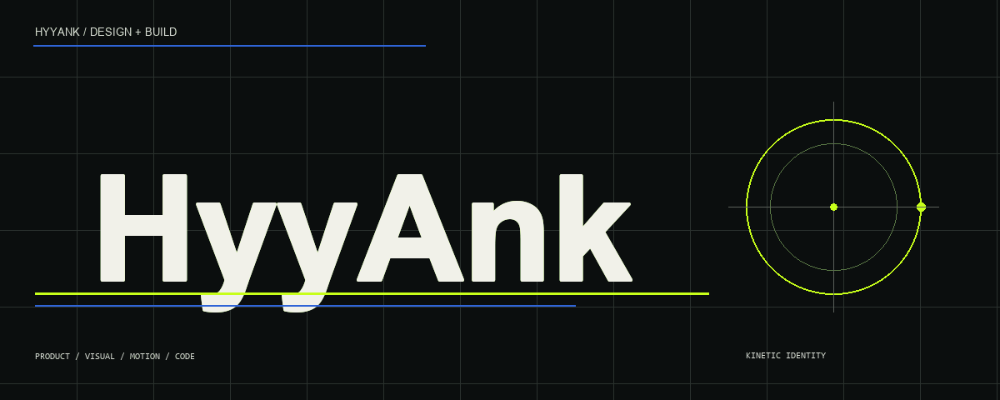
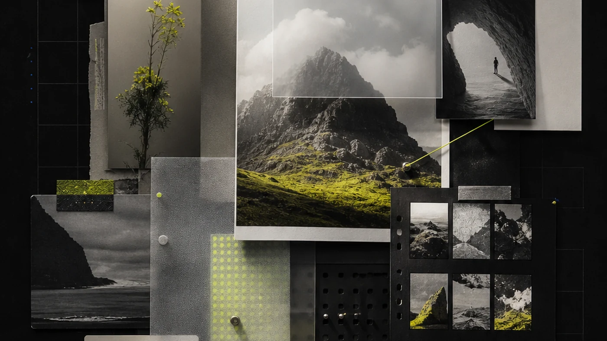
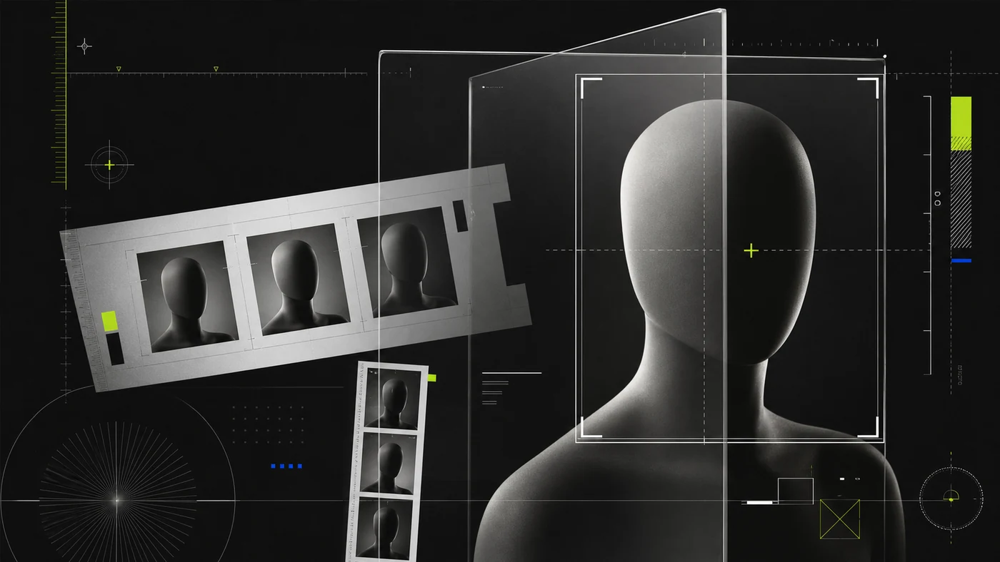
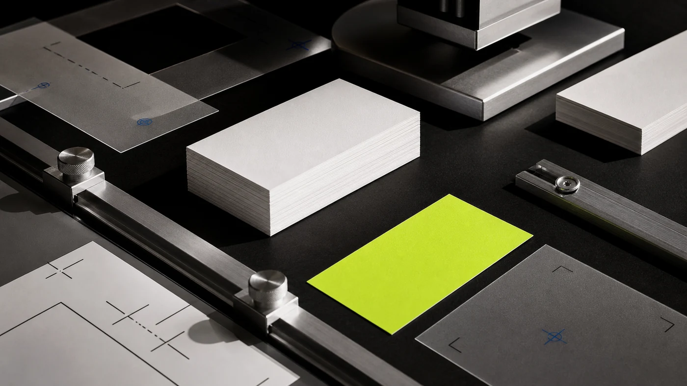
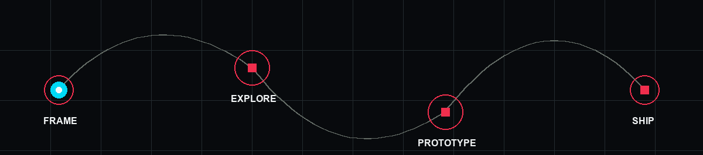
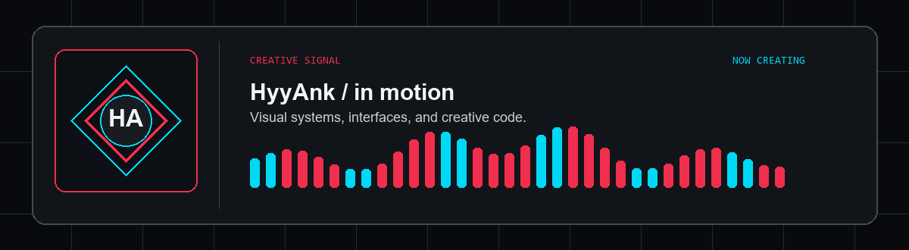
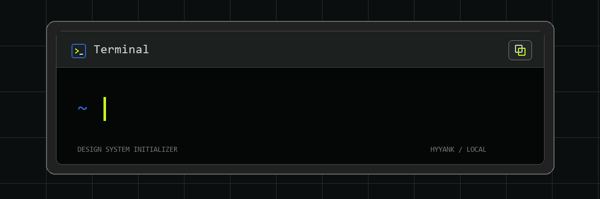

<div align="center">
  
</div>

<br>

<div align="center">
  <a href="#selected-work"></a>
  <a href="https://x.com/0x_HyyAnk"></a>
  <a href="https://github.com/HyyAnk?tab=repositories"></a>
</div>

<br>

## I design systems that move.

I am Hoàng [Anh], a designer and maker working across product interfaces, visual systems, creative tools, and high-fidelity prototypes. I use code to push ideas beyond static frames and test how a design behaves in the real world.

```text
PRODUCT THINKING  +  VISUAL DIRECTION  +  INTERACTION  +  PROTOTYPING
```

<br>

## Selected work

<a href="https://github.com/HyyAnk/Merge-Board-Node">
  
</a>

### [MergeBoard](https://github.com/HyyAnk/Merge-Board-Node)

A local-first visual workspace for organizing images and text. The product combines a portable folder structure, bilingual interface, and privacy-first browser workflow.

`PRODUCT DESIGN` `LOCAL-FIRST UX` `REACT` `BROWSER API`

<br>

<table>
  <tr>
    <td width="50%" valign="top">
      <a href="https://github.com/HyyAnk/Photo-ID-Studio">
        
      </a>
    </td>
    <td width="50%" valign="top">
      <a href="https://github.com/HyyAnk/Pdf-business-card-stamper">
        
      </a>
    </td>
  </tr>
  <tr>
    <td width="50%" valign="top">
      <h3><a href="https://github.com/HyyAnk/Photo-ID-Studio">Photo ID Studio</a></h3>
      <p>A focused creative tool for precise photo preparation, guided cropping, and practical output.</p>
      <code>INTERFACE DESIGN</code> <code>CREATIVE TOOLING</code>
    </td>
    <td width="50%" valign="top">
      <h3><a href="https://github.com/HyyAnk/Pdf-business-card-stamper">PDF Business Card Stamper</a></h3>
      <p>A print-production utility designed to make repetitive business-card placement faster and more consistent.</p>
      <code>WORKFLOW DESIGN</code> <code>PRINT AUTOMATION</code>
    </td>
  </tr>
</table>

<br>

## The design loop



The loop is deliberately non-linear. Framing sets direction, exploration creates options, and working prototypes reveal what static screens cannot.

<br>

## Creative technology

<div align="center">
  
</div>

<br>

I am most interested in creative tools, AI-assisted media workflows, browser-native experiences, and small products where design and engineering shape each other.

<br>

## Creative signal



<br>

## Creative pulse


<br>



<br>

## Contributions in motion


<br>

## Design, then make it real.

Good design is not decoration added at the end. It is the structure, behavior, rhythm, and decisions that make a product understandable.

If you are building a useful digital product, [start a conversation](https://x.com/0x_HyyAnk).
