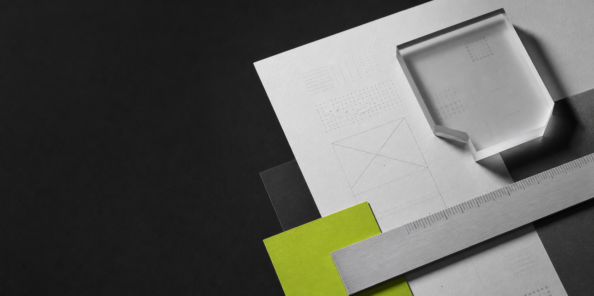

<br>

<sub>HOÀNG ANH / DESIGNER + MAKER</sub>

# I design clear interfaces and useful digital products.

I work across product thinking, visual direction, and high-fidelity prototypes. Code is part of my design process: it helps me test ideas, understand constraints, and bring the final experience closer to the original intent.

[View selected work](#selected-work) &nbsp;/&nbsp; [Follow on X](https://x.com/0x_HyyAnk)

<br>

## Design practice

**Product and interface**<br>
Turning complex workflows into focused flows, clear hierarchy, and usable screens.

**Visual systems**<br>
Building consistent typography, layout, color, and component decisions that scale beyond one screen.

**Prototype and build**<br>
Using React, TypeScript, and browser APIs to turn static concepts into working product experiments.

<br>

## Selected work

### [MergeBoard](https://github.com/HyyAnk/Merge-Board-Node)

A local-first visual workspace for organizing images and text. Designed around a portable folder structure, bilingual UI, and a privacy-first browser workflow.

`Product design` `Local-first UX` `React` `File System Access API`

### [Photo ID Studio](https://github.com/HyyAnk/Photo-ID-Studio)

A focused studio tool for preparing photo ID assets. An exploration of guided workflows, precise output, and practical visual tooling.

`Interface design` `Creative tooling` `JavaScript`

### [PDF Business Card Stamper](https://github.com/HyyAnk/Pdf-business-card-stamper)

A production utility for placing business-card content into PDF workflows. Built to make a repetitive print task faster and more consistent.

`Workflow design` `Print automation` `TypeScript`

### [AI Media Studio](https://github.com/HyyAnk/Image-video-Google-API---Aistudio)

An interface experiment for generating images and video with Google's media APIs.

`AI interaction` `Rapid prototyping` `TypeScript`

<br>

## How I work

I start with the job a screen needs to do, reduce friction in the flow, then refine the visual system until every decision feels intentional. I like prototypes that are close enough to reality to expose the right problems early.

Currently exploring creative tools, AI-assisted media workflows, and small products where design and engineering meet.

<br>

## Beyond the canvas

```text
Design     Product thinking / Interaction / Visual systems / Prototyping
Build      TypeScript / JavaScript / React / Node.js / Python
Based in   Vietnam
```

<br>

If you are working on a useful digital product, I would be happy to hear about it.

[Start a conversation](https://x.com/0x_HyyAnk)
